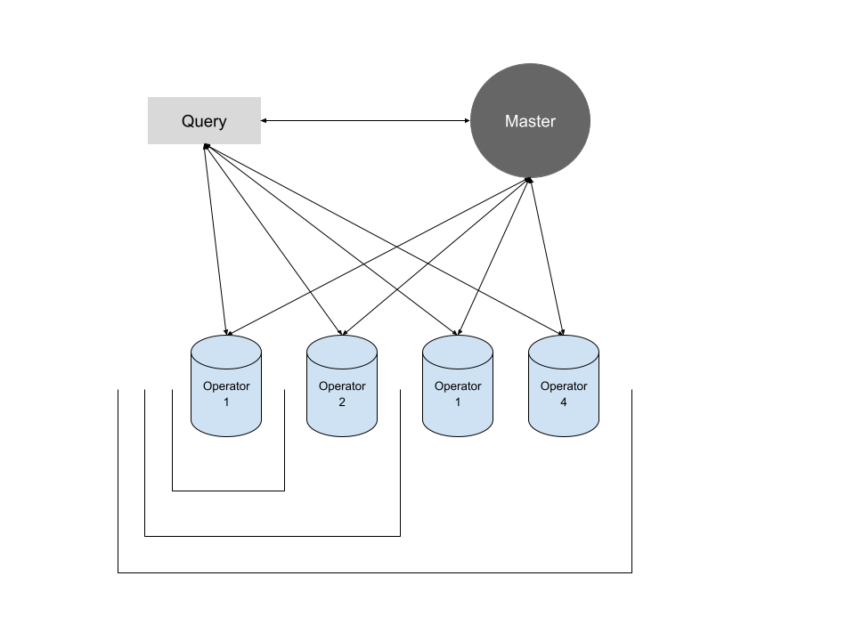

# Performance Testing 

The following package is intended to demonstrate performance testing against AnyLog. 

Please review our [documentation](https://github.com/AnyLog-co/documentation) information and support regarding the 
details of using AnyLog. 


## Deploying Nodes
The following requires 6 machines either physical or virtual, that can communicate with one another. The original 
performance testing was done in comperecent of 1, 2 and 4 operator nodes, each associated to a different cluster; as 
shown in the diagram below. 




* Setting Up _Master Node_ on Machine 1 
  1. Clone _performance-testing_ and log into _anyloguser_ on **all** machines
  ```shell
  git clone https://github.com/AnyLog-co/performance-testing
  docker login -u anyloguser -p ${USER_API_PASSWORD}
  ```
  2. Deploy Postgres 
  ```shell
  cd performance-testing/deployments/postgres 
  docker-compose up -d    
  ```
  3. Deploy Master Node
    ```shell
    cd performance-testing/deployments/anylog-master 
    docker-compose up -d 
    ```
  4. Get Master Node TCP connection information - which will be used for the blockchain
  ```anylog
  # docker attach --detach-keys=ctrl-d anylog-master 
  AL master-node +> get connections 

    Type      External Address     Local Address        
    ---------|--------------------|--------------------|
    TCP      |172.104.138.63:32048|172.104.138.63:32048|
    REST     |172.104.138.63:32049|172.104.138.63:32049|
    Messaging|Not declared        |Not declared        |
  ```
  

* Setting Up _Query Node_ - The query node is deployed with our [Remote-CLI](https://github.com/AnyLog-co/documentation/blob/master/northbound%20connectors/remote_cli.md)
  1. Clone _performance-testing_ and log into _anyloguser_ on **all** machines
  ```shell
  git clone https://github.com/AnyLog-co/performance-testing
  docker login -u anyloguser -p ${USER_API_PASSWORD}
  ```
  2. Update `ledger_conn` value in [anylog_configs.env](deployments/query-remote-cli/anylog_configs.env) 
  ```dotenv
  # vim deployments/query-remote-cli/anylog_configs.env
  
  # line 13 with local LEDGER_CONN value 
  LEDGER_CONN=127.0.0.1:32048
  
  # Update LEDGER_CNN value
  LEDGER_CONN=172.104.138.63:32048
  ```
  3. Deploy Query Node
  ```shell
  cd performance-testing/deployments/query-remote-cli 
  docker-compose up -d 
  ```
  

* Setting up _Operator Node_ - Repeat the following steps on each physical node that will act as an operator. Keep in  
in mind that each _anylog-operator_ directory is associated o a **unique** cluster.  
  1. Clone _performance-testing_ and log into _anyloguser_ on **all** machines
  ```shell
  git clone https://github.com/AnyLog-co/performance-testing
  docker login -u anyloguser -p ${USER_API_PASSWORD}
  ```
  2. Update `ledger_conn` value in [anylog_configs.env](deployments/anylog-operator1/anylog_config.env) 
  ```dotenv
  # vim deployments/query-remote-cli/anylog_configs.env
  
  # line 13 with local LEDGER_CONN value 
  LEDGER_CONN=127.0.0.1:32048
  
  # Update LEDGER_CNN value
  LEDGER_CONN=172.104.138.63:32048
  ```
  3. Deploy Query Node
  ```shell
  cd performance-testing/deployments/query-remote-cli 
  docker-compose up -d 
  ```
  

